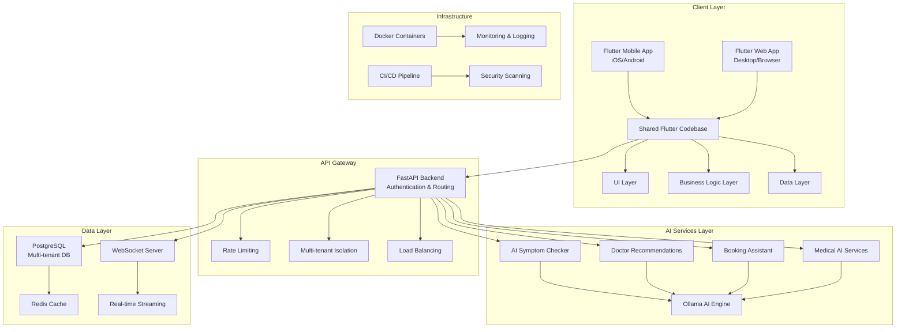

# High-Level Architecture - AI Doctor System Flutter Client

## System Overview

The AI Doctor System Flutter client follows a modern, scalable architecture that supports both mobile and web platforms while maintaining enterprise-grade security, performance, and user experience standards.

## Architecture Diagram



## Architecture Principles

### 1. **Clean Architecture**
- **Separation of Concerns**: Clear boundaries between UI, business logic, and data layers
- **Dependency Inversion**: High-level modules don't depend on low-level modules
- **Testability**: Each layer can be tested independently with mock dependencies

### 2. **Domain-Driven Design (DDD)**
- **Bounded Contexts**: Clear domain boundaries for different business areas
- **Aggregate Roots**: Consistent data integrity across related entities
- **Value Objects**: Immutable objects representing domain concepts

### 3. **Multi-Tenant Architecture**
- **Data Isolation**: Complete separation of organization data
- **Shared Infrastructure**: Efficient resource utilization across tenants
- **Scalable Security**: Role-based access control with tenant boundaries

### 4. **Offline-First Design**
- **Local Data Storage**: SQLite for offline data persistence
- **Intelligent Synchronization**: Conflict resolution and data consistency
- **Graceful Degradation**: Core functionality available without network

## System Components

### Client Architecture

#### **Presentation Layer**
```dart
// Clean Architecture Structure
lib/
├── presentation/
│   ├── pages/           # Screen implementations
│   ├── widgets/         # Reusable UI components
│   ├── controllers/     # GetX controllers for state management
│   └── bindings/        # Dependency injection bindings
├── domain/
│   ├── entities/        # Business entities
│   ├── repositories/    # Repository interfaces
│   ├── usecases/        # Business logic use cases
│   └── services/        # Domain services
└── data/
    ├── repositories/    # Repository implementations
    ├── datasources/     # API and local data sources
    ├── models/          # Data transfer objects
    └── services/        # External service integrations
```

#### **State Management with GetX**
```dart
class AppointmentController extends GetxController {
  final AppointmentRepository _repository;
  
  final RxList<Appointment> appointments = <Appointment>[].obs;
  final RxBool isLoading = false.obs;
  final RxString errorMessage = ''.obs;
  
  @override
  void onInit() {
    super.onInit();
    loadAppointments();
  }
  
  Future<void> loadAppointments() async {
    try {
      isLoading.value = true;
      final result = await _repository.getAppointments();
      appointments.value = result;
    } catch (e) {
      errorMessage.value = e.toString();
    } finally {
      isLoading.value = false;
    }
  }
}
```

#### **Dependency Injection**
```dart
class AppBindings extends Bindings {
  @override
  void dependencies() {
    // Repositories
    Get.lazyPut<AppointmentRepository>(
      () => AppointmentRepositoryImpl(
        remoteDataSource: Get.find(),
        localDataSource: Get.find(),
      ),
    );
    
    // Controllers
    Get.lazyPut<AppointmentController>(
      () => AppointmentController(
        repository: Get.find(),
      ),
    );
  }
}
```

### Data Flow Architecture

#### **REST API Integration**
```dart
class ApiClient {
  static const String baseUrl = 'https://api.aidoctorsystem.com/api/v1';
  
  Future<Response<T>> get<T>(
    String path, {
    Map<String, dynamic>? queryParameters,
    Options? options,
  }) async {
    final token = await AuthService.getAccessToken();
    
    return dio.get<T>(
      '$baseUrl$path',
      queryParameters: queryParameters,
      options: options?.copyWith(
        headers: {
          ...?options?.headers,
          'Authorization': 'Bearer $token',
        },
      ),
    );
  }
}
```

#### **WebSocket Real-time Communication**
```dart
class WebSocketService {
  late WebSocketChannel _channel;
  final StreamController<Map<String, dynamic>> _messageController = 
      StreamController.broadcast();
  
  Future<void> connect(String endpoint) async {
    final token = await AuthService.getAccessToken();
    final uri = Uri.parse('wss://api.aidoctorsystem.com/api/v1$endpoint?token=$token');
    
    _channel = WebSocketChannel.connect(uri);
    
    _channel.stream.listen(
      (data) {
        final message = jsonDecode(data);
        _messageController.add(message);
      },
      onError: (error) => _handleError(error),
      onDone: () => _handleDisconnection(),
    );
  }
  
  void sendMessage(Map<String, dynamic> message) {
    _channel.sink.add(jsonEncode(message));
  }
}
```

### Multi-Tenant Data Model

#### **Organization Isolation**
```dart
class BaseEntity {
  final String id;
  final String organizationId;
  final DateTime createdAt;
  final DateTime updatedAt;
  
  const BaseEntity({
    required this.id,
    required this.organizationId,
    required this.createdAt,
    required this.updatedAt,
  });
}

class Appointment extends BaseEntity {
  final String doctorId;
  final String patientId;
  final DateTime scheduledAt;
  final AppointmentStatus status;
  final String? notes;
  
  const Appointment({
    required String id,
    required String organizationId,
    required DateTime createdAt,
    required DateTime updatedAt,
    required this.doctorId,
    required this.patientId,
    required this.scheduledAt,
    required this.status,
    this.notes,
  }) : super(
    id: id,
    organizationId: organizationId,
    createdAt: createdAt,
    updatedAt: updatedAt,
  );
}
```

#### **Repository Pattern with Multi-tenancy**
```dart
abstract class AppointmentRepository {
  Future<List<Appointment>> getAppointments();
  Future<Appointment> createAppointment(CreateAppointmentRequest request);
  Future<void> updateAppointment(String id, UpdateAppointmentRequest request);
  Future<void> deleteAppointment(String id);
}

class AppointmentRepositoryImpl implements AppointmentRepository {
  final AppointmentRemoteDataSource _remoteDataSource;
  final AppointmentLocalDataSource _localDataSource;
  final AuthService _authService;
  
  AppointmentRepositoryImpl({
    required AppointmentRemoteDataSource remoteDataSource,
    required AppointmentLocalDataSource localDataSource,
    required AuthService authService,
  }) : _remoteDataSource = remoteDataSource,
       _localDataSource = localDataSource,
       _authService = authService;
  
  @override
  Future<List<Appointment>> getAppointments() async {
    final organizationId = await _authService.getCurrentOrganizationId();
    
    try {
      final appointments = await _remoteDataSource.getAppointments(organizationId);
      await _localDataSource.cacheAppointments(appointments);
      return appointments;
    } catch (e) {
      // Fallback to local data
      return await _localDataSource.getCachedAppointments(organizationId);
    }
  }
}
```

## Security Architecture

### **Authentication Flow**
```dart
class AuthService {
  static const String _accessTokenKey = 'access_token';
  static const String _refreshTokenKey = 'refresh_token';
  static const String _userDataKey = 'user_data';
  
  Future<AuthResult> login(String email, String password) async {
    final response = await _apiClient.post('/auth/login', data: {
      'username': email,
      'password': password,
    });
    
    final tokens = AuthTokens.fromJson(response.data);
    final user = await _getUserProfile(tokens.accessToken);
    
    await _storeTokens(tokens);
    await _storeUserData(user);
    
    return AuthResult.success(user, tokens);
  }
  
  Future<String?> getAccessToken() async {
    final token = await _secureStorage.read(key: _accessTokenKey);
    
    if (token != null && !_isTokenExpired(token)) {
      return token;
    }
    
    return await _refreshAccessToken();
  }
}
```

### **Data Plane Security**

#### **Certificate Pinning**
```dart
class SecureHttpClient {
  late Dio _dio;
  
  SecureHttpClient() {
    _dio = Dio();
    _setupCertificatePinning();
  }
  
  void _setupCertificatePinning() {
    (_dio.httpClientAdapter as IOHttpClientAdapter).onHttpClientCreate = (client) {
      client.badCertificateCallback = (cert, host, port) {
        return _validateCertificate(cert, host);
      };
      return client;
    };
  }
  
  bool _validateCertificate(X509Certificate cert, String host) {
    // Implement certificate pinning logic
    final expectedFingerprint = 'SHA256:expected_fingerprint_here';
    final actualFingerprint = cert.sha256;
    return actualFingerprint == expectedFingerprint;
  }
}
```

#### **Data Encryption**
```dart
class EncryptionService {
  static const String _algorithm = 'AES-256-GCM';
  
  Future<String> encrypt(String plaintext) async {
    final key = await _getEncryptionKey();
    final iv = _generateIV();
    
    final cipher = encrypt.AES(
      encrypt.Key.fromBase64(key),
      mode: encrypt.AESMode.gcm,
    );
    
    final encrypted = cipher.encrypt(
      encrypt.Encrypted.fromUtf8(plaintext),
      iv: encrypt.IV.fromBase64(iv),
    );
    
    return '$iv:${encrypted.base64}';
  }
  
  Future<String> decrypt(String encryptedData) async {
    final parts = encryptedData.split(':');
    final iv = parts[0];
    final encrypted = parts[1];
    
    final key = await _getEncryptionKey();
    final cipher = encrypt.AES(
      encrypt.Key.fromBase64(key),
      mode: encrypt.AESMode.gcm,
    );
    
    final decrypted = cipher.decrypt(
      encrypt.Encrypted.fromBase64(encrypted),
      iv: encrypt.IV.fromBase64(iv),
    );
    
    return decrypted;
  }
}
```

## Performance Architecture

### **Caching Strategy**
```dart
class CacheManager {
  final Map<String, CacheEntry> _memoryCache = {};
  final SharedPreferences _preferences;
  
  Future<T?> get<T>(String key, {Duration? maxAge}) async {
    final entry = _memoryCache[key];
    
    if (entry != null && !entry.isExpired(maxAge)) {
      return entry.data as T;
    }
    
    final cachedData = await _preferences.getString(key);
    if (cachedData != null) {
      final data = jsonDecode(cachedData) as T;
      _memoryCache[key] = CacheEntry(data, DateTime.now());
      return data;
    }
    
    return null;
  }
  
  Future<void> set<T>(String key, T data, {Duration? ttl}) async {
    _memoryCache[key] = CacheEntry(data, DateTime.now());
    await _preferences.setString(key, jsonEncode(data));
  }
}
```

### **Image Optimization**
```dart
class ImageService {
  static const int maxImageSize = 1024 * 1024; // 1MB
  static const int maxThumbnailSize = 200;
  
  Future<String> optimizeImage(String imagePath) async {
    final image = img.decodeImage(File(imagePath).readAsBytesSync());
    
    if (image == null) throw Exception('Invalid image');
    
    // Resize if too large
    if (image.width > maxThumbnailSize || image.height > maxThumbnailSize) {
      final resized = img.copyResize(
        image,
        width: maxThumbnailSize,
        height: maxThumbnailSize,
        maintainAspect: true,
      );
      
      final optimizedBytes = img.encodeJpg(resized, quality: 85);
      return await _saveOptimizedImage(optimizedBytes);
    }
    
    return imagePath;
  }
}
```

## Scalability Considerations

### **Horizontal Scaling Support**
- **Stateless Design**: No server-side session storage
- **Load Balancer Ready**: Multiple API gateway instances
- **Database Sharding**: Organization-based data partitioning
- **CDN Integration**: Static asset delivery optimization

### **Performance Monitoring**
```dart
class PerformanceMonitor {
  static void trackScreenTime(String screenName, Duration duration) {
    analytics.trackEvent('screen_time', {
      'screen': screenName,
      'duration_ms': duration.inMilliseconds,
    });
  }
  
  static void trackApiCall(String endpoint, Duration duration, bool success) {
    analytics.trackEvent('api_call', {
      'endpoint': endpoint,
      'duration_ms': duration.inMilliseconds,
      'success': success,
    });
  }
}
```

## Deployment Architecture

### **Multi-Environment Support**
```yaml
# pubspec.yaml
name: ai_doctor_system
description: AI-powered healthcare management system

dependencies:
  flutter:
    sdk: flutter
  get: ^4.6.6
  dio: ^5.4.0
  websocket: ^1.0.4
  sqflite: ^2.3.0
  flutter_secure_storage: ^9.0.0
```

### **Environment Configuration**
```dart
class EnvironmentConfig {
  static const String _environment = String.fromEnvironment('ENV', defaultValue: 'development');
  
  static String get apiBaseUrl {
    switch (_environment) {
      case 'production':
        return 'https://api.aidoctorsystem.com';
      case 'staging':
        return 'https://staging-api.aidoctorsystem.com';
      default:
        return 'http://localhost:8000';
    }
  }
  
  static String get websocketUrl {
    switch (_environment) {
      case 'production':
        return 'wss://api.aidoctorsystem.com';
      case 'staging':
        return 'wss://staging-api.aidoctorsystem.com';
      default:
        return 'ws://localhost:8000';
    }
  }
}
```

## Integration Points

### **AI Services Integration**
- **Symptom Checker**: Real-time conversational symptom analysis
- **Doctor Recommendations**: AI-powered matching algorithm
- **Booking Assistant**: Natural language appointment scheduling
- **Medical AI**: Consultation summaries, lab reports, prescription analysis

### **Third-Party Integrations**
- **Payment Processing**: Stripe/PayPal integration for premium subscriptions
- **Push Notifications**: Firebase Cloud Messaging for real-time alerts
- **Analytics**: Firebase Analytics for user behavior tracking
- **Crash Reporting**: Firebase Crashlytics for error monitoring

## Monitoring and Observability

### **Application Performance Monitoring**
```dart
class APMService {
  static void trackUserAction(String action, Map<String, dynamic>? properties) {
    // Track user interactions
    analytics.trackEvent(action, properties);
  }
  
  static void trackError(String error, StackTrace stackTrace) {
    // Track application errors
    crashlytics.recordError(error, stackTrace);
  }
  
  static void trackPerformance(String operation, Duration duration) {
    // Track performance metrics
    performance.trace(operation, duration);
  }
}
```

### **Health Checks**
```dart
class HealthCheckService {
  Future<HealthStatus> checkSystemHealth() async {
    final checks = await Future.wait([
      _checkApiConnectivity(),
      _checkDatabaseConnection(),
      _checkWebSocketConnection(),
      _checkCacheHealth(),
    ]);
    
    return HealthStatus(
      isHealthy: checks.every((check) => check.isHealthy),
      checks: checks,
      timestamp: DateTime.now(),
    );
  }
}
```

This architecture provides a solid foundation for building a scalable, secure, and performant AI-first healthcare management system that can serve thousands of users across multiple organizations while maintaining enterprise-grade security and compliance standards.
